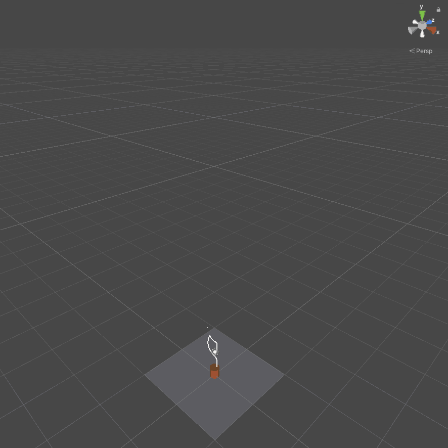
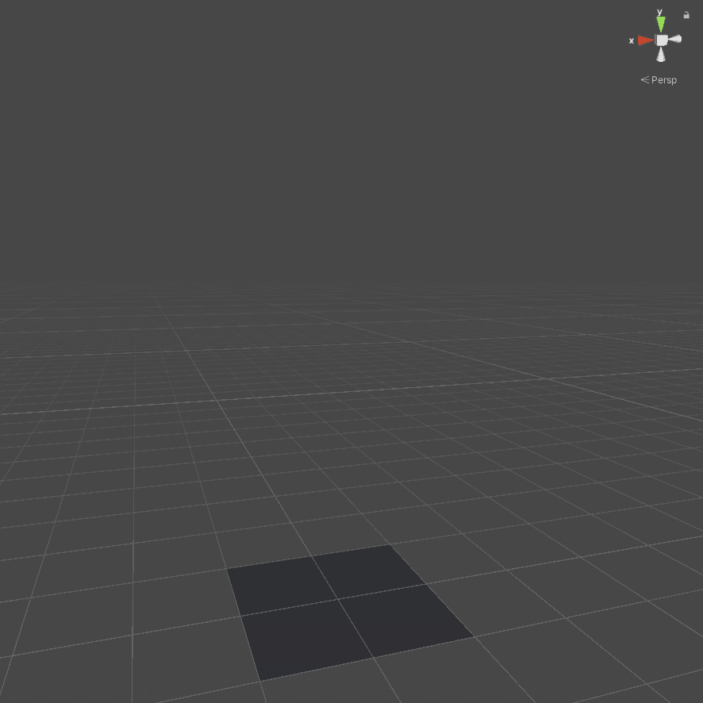

# 🌿 PhyloGenesis

**Procedural Tree Generation Game**  
*Create, evolve, and explore endlessly unique trees and plants.*

---

## What is PhyloGenesis?

**PhyloGenesis** is a creative procedural generation game where you can craft your own trees and plants—each one entirely **unique**, **organic**, and **unpredictable**.

Built using **Unity** and **C#**, this sandbox experience is powered by nature-inspired procedural algorithms, enabling the growth of plants that feel alive and endlessly diverse.

Whether you're a nature lover, developer, or just love watching things grow, **PhyloGenesis** lets you:

- Generate infinite tree species with unique traits  
- Tweak growth parameters like branch density, curvature, and leaf clusters  
- Build entire biomes of procedurally generated flora  
- Export or capture your creations as images or 3D models (planned)

---

## Features

- Built in **Unity** with **C#**  
- Fully procedural tree and plant generation  
- Real-time growth simulation  
- Customizable environmental parameters  
- Save and load seed configurations  

**Coming Soon:**
- Tree evolution via cross-pollination
- VR garden mode
- Export to `.obj` or `.glTF` formats
- Environmental interaction (wind, seasons, terrain)

